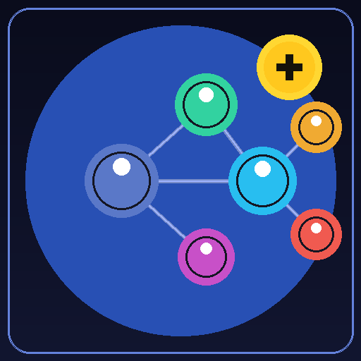

<a id="readme-top"></a>

<!-- PROJECT SHIELDS -->
[![Contributors][contributors-shield]][contributors-url]
[![Forks][forks-shield]][forks-url]
[![Stargazers][stars-shield]][stars-url]
[![Issues][issues-shield]][issues-url]
[![MIT License][license-shield]][license-url]
[![VS Code][vscode-shield]][vscode-url]

<br />
<div align="center">
  <a href="https://github.com/Antman1526/CodeVisualizerPlus">
    
  </a>

  <h3 align="center">CodeVisualizer Plus</h3>

  <p align="center">
    Real-time interactive flowcharts, dependency graphs, and Markdown structure visualization for your entire codebase
    <br />
    <a href="https://marketplace.visualstudio.com/items?itemName=DucPhamNgoc.codevisualizer"><strong>Download Original from VS Code Marketplace »</strong></a>
    <br /><br />
    <a href="https://github.com/Antman1526/CodeVisualizerPlus/issues/new?labels=bug">Report Bug</a>
    ·
    <a href="https://github.com/Antman1526/CodeVisualizerPlus/issues/new?labels=enhancement">Request Feature</a>
  </p>
</div>

---

> **This is a community fork of [CodeVisualizer](https://github.com/DucPhamNgoc08/CodeVisualizer) by [Duc Pham Ngoc](https://github.com/DucPhamNgoc08).**
> All core architecture, language parsers, flowchart engine, AI label system, and original design are his work.
> This fork adds Markdown document visualization, improved unsupported-file messages, a working export command, codebase dependency graph support for **Java, C, C++, Rust, Go, and Markdown**, and an auto README preview.
> Please ⭐ the [original repository](https://github.com/DucPhamNgoc08/CodeVisualizer) if you find this useful.

---

## Table of Contents

- [About](#about)
- [Key Features](#key-features)
- [Supported Languages](#supported-languages)
- [Installation](#installation)
  - [VS Code](#vs-code)
  - [Cursor](#cursor)
  - [Windsurf](#windsurf)
  - [Other VS Code-Compatible Editors](#other-vs-code-compatible-editors)
  - [Install from VSIX](#install-from-vsix)
- [Usage](#usage)
  - [Function Flowcharts](#function-flowcharts)
  - [Markdown Visualization](#markdown-visualization)
  - [Codebase Dependency Graph](#codebase-dependency-graph)
  - [AI-Powered Labels](#ai-powered-labels)
  - [Exporting Diagrams](#exporting-diagrams)
- [How It Works](#how-it-works)
- [Configuration](#configuration)
- [Privacy & Security](#privacy--security)
- [Development Setup](#development-setup)
- [Contributing](#contributing)
- [License](#license)

---

## About

CodeVisualizer Plus transforms the way developers understand and navigate code. Whether you're onboarding to a new codebase, debugging complex logic, documenting architecture, or simply reading a Markdown doc, CodeVisualizer generates instant, interactive visual diagrams — all without leaving your editor.

**Three visualization modes, one extension:**

| Mode | What it shows |
|------|--------------|
| **Function Flowchart** | Control flow, decision points, loops, and exception handling inside a single function |
| **Markdown Structure** | Heading hierarchy (H1 → H2 → H3) and outbound links as an interactive diagram |
| **Codebase Dependency Graph** | Module-level import/require/include relationships across your entire project — supports JS/TS, Python, Java, C, C++, Rust, Go, and Markdown |

---

## Key Features

### Function-Level Flowcharts
- Parse and visualize functions in **8 languages** using Tree-sitter WASM parsers
- Interactive nodes — click to jump directly to the corresponding code line
- Auto-refresh as you type (debounced, 500 ms)
- **9 color themes**: Monokai, Catppuccin, GitHub, Solarized, One Dark Pro, Dracula, Material Theme, Nord, Tokyo Night
- Code Metrics panel showing lines of code, branches, decision points, and more
- Open in sidebar, panel, new column, or full window

### Markdown Document Visualization *(new)*
- Opens automatically when you navigate to any `.md` file
- **Structure tree**: heading hierarchy rendered as a visual flowchart (H1 as root, H2/H3 as children)
- **Link graph**: outbound `[text](url)` links shown as labeled edges — internal file links and external URLs distinguished visually
- Click headings in the diagram to jump to that section in the editor
- Works on README files, wikis, changelogs, and any other Markdown documents

### Codebase Dependency Visualization *(enhanced)*
- Right-click any folder → **"Visualize Codebase Flow"**
- Supports **8 language families**: TypeScript/JavaScript, Python, Java, C, C++, Rust, Go, and Markdown
- Document cross-links (`.md` files) appear alongside code imports in the same graph
- Color-coded file categories: Core (green), Report/Docs (pink), Config (blue), Tools (orange), Entry (grey)
- Subgraphs organized by directory structure
- Build artifacts skipped automatically (`node_modules`, `target/`, `vendor/`, `dist/`, etc.)
- **Auto README preview**: if the selected folder has a `README.md`, it opens in VS Code's built-in Markdown preview panel automatically

### Export Diagrams *(now fully implemented)*
- Command Palette → **"CodeVisualizer: Export Flowchart"**
- Choose **PNG** (2× high-DPI) or **SVG** (fully scalable vector)
- Export buttons also available directly inside the diagram panel
- Saved to a location of your choice via the standard Save dialog

### AI-Powered Labels (Function Flowcharts)
- Replace cryptic variable names and expressions with human-friendly descriptions
- Supports **OpenAI, Gemini, Groq, Ollama (local), and Anthropic**
- Intelligent caching minimises API calls
- Configurable label style: Concise, Explanatory, or Technical
- All AI features are **opt-in** and disabled by default

---

## Supported Languages

### Function-Level Flowcharts

| Language | Status |
|----------|--------|
| Python | ✅ Full Support |
| TypeScript / JavaScript | ✅ Full Support |
| Java | ✅ Full Support |
| C++ | ✅ Full Support |
| C | ✅ Full Support |
| Rust | ✅ Full Support |
| Go | ✅ Full Support |
| **Markdown** | ✅ **Full Support (new)** |

### Codebase Dependency Visualization

| Language | File Extensions | Status |
|----------|----------------|--------|
| TypeScript / JavaScript | `.ts`, `.tsx`, `.js`, `.jsx`, `.mjs`, `.cjs` | ✅ Full Support |
| Python | `.py` | ✅ Full Support |
| **Java** | `.java` | ✅ **Full Support (new)** |
| **C / C++** | `.c`, `.h`, `.cpp`, `.hpp`, `.cc`, `.cxx` | ✅ **Full Support (new)** |
| **Rust** | `.rs` | ✅ **Full Support (new)** |
| **Go** | `.go` | ✅ **Full Support (new)** |
| **Markdown** | `.md` | ✅ **Full Support (new)** |

---

## Installation

### VS Code

The quickest path is the VS Code Marketplace:

1. Open VS Code
2. Press `Ctrl+Shift+X` (Windows/Linux) or `Cmd+Shift+X` (macOS) to open the Extensions sidebar
3. Search for **CodeVisualizer**
4. Click **Install** on the extension by *DucPhamNgoc*
5. Reload VS Code if prompted

### Cursor

Cursor is fully compatible with VS Code extensions:

1. Open Cursor
2. Press `Ctrl+Shift+X` (Windows/Linux) or `Cmd+Shift+X` (macOS)
3. In the Extensions panel search bar, type **CodeVisualizer**
4. Click **Install**

> **Note:** Cursor uses a compatibility mode that CodeVisualizer detects automatically. You may see a brief info message on first launch — this is expected and the extension works normally.

### Windsurf

Windsurf (by Codeium) supports VS Code extensions via its Extension Gallery:

1. Open Windsurf
2. Click the **Extensions** icon in the Activity Bar (or press `Ctrl+Shift+X`)
3. Search for **CodeVisualizer**
4. Click **Install**

If the Marketplace is unavailable in your Windsurf build, install via VSIX (see below).

### Other VS Code-Compatible Editors

Any editor built on the VS Code engine (Gitpod, Eclipse Theia, Code - OSS, VSCodium, etc.) can install the extension via VSIX:

### Install from VSIX

Use this method when you have a `.vsix` file (downloaded from the Marketplace or built locally):

**Option A — Command line:**
```bash
code --install-extension codevisualizer-1.0.6.vsix
```
Replace `code` with your editor's CLI command (`cursor`, `windsurf`, etc.) if needed.

**Option B — Editor UI:**
1. Open the Extensions sidebar
2. Click the **`···`** (More Actions) menu in the top-right corner of the panel
3. Select **"Install from VSIX…"**
4. Browse to and select the `.vsix` file

**Option C — Build from source** (developers):
```bash
git clone https://github.com/DucPhamNgoc08/CodeVisualizer.git
cd CodeVisualizer
npm install
npm run package        # produces codevisualizer-x.x.x.vsix in the project root
code --install-extension codevisualizer-*.vsix
```

---

## Usage

### Function Flowcharts

1. Open any supported source file
2. Place your cursor inside a function
3. Right-click → **"CodeVisualizer: Open Flowchart in New Window"**
   — or use the Command Palette (`Ctrl+Shift+P` / `Cmd+Shift+P`) and type `CodeVisualizer`
4. The interactive flowchart opens in a panel:
   - **Click a node** to jump to that line in the editor
   - **Scroll / pinch** to zoom, **drag** to pan
   - **Switch themes** using the settings icon in the toolbar

The sidebar flowchart updates automatically as you move between functions or edit code.

### Markdown Visualization

1. Open any `.md` file in your editor
2. The CodeVisualizer sidebar (or panel if already open) automatically renders the document structure
3. The diagram shows:
   - **Heading nodes** — H1 as the root, H2 as direct children, H3 as grandchildren, etc.
   - **Link nodes** — pages or URLs referenced via `[text](url)` syntax, connected by labeled dashed edges; 🌐 prefix for external URLs, 📄 for local file links
4. Click a heading node to scroll the editor to that heading

### Codebase Dependency Graph

1. In the Explorer sidebar, **right-click any folder**
2. Select **"Visualize Codebase Flow"**
   — or run it from the Command Palette
3. The dependency graph opens in a new panel
4. If the folder contains a `README.md`, VS Code's built-in Markdown preview opens automatically to the side
5. In the graph:
   - Each node is a file, color-coded by category
   - Arrows show import/require/link relationships
   - Files are grouped into subgraphs by directory

### AI-Powered Labels

1. Run **"CodeVisualizer: Enable AI Labels"** from the Command Palette
2. Choose a provider (OpenAI, Gemini, Groq, Ollama, Anthropic) and enter your API key
3. Generate a flowchart — node labels will automatically be replaced with human-friendly descriptions
4. Toggle labels on/off with the **LLM** button in the diagram toolbar

For completely local/private label generation, choose **Ollama** — no API key or internet connection required.

### Exporting Diagrams

**From the toolbar** (inside any open diagram):
- Click **SVG** or **PNG** buttons

**From the Command Palette:**
1. Press `Ctrl+Shift+P` / `Cmd+Shift+P`
2. Type **"CodeVisualizer: Export Flowchart"**
3. Select **PNG** or **SVG** from the quick-pick menu
4. Choose a save location

PNG exports are generated at 2× resolution for crisp display on high-DPI screens. SVG exports are fully scalable and suitable for embedding in documentation.

---

## How It Works

### Function Flowchart Pipeline

1. **Parsing** — Tree-sitter WASM parsers convert source code into an Abstract Syntax Tree (AST)
2. **Analysis** — AST traversal identifies control structures, loops, exception handling, async operations, and function boundaries
3. **IR Generation** — The AST is transformed into an Intermediate Representation (IR) with typed nodes and directed edges
4. **Mermaid Generation** — The IR is converted to Mermaid diagram syntax with theme-aware styling
5. **Rendering** — Mermaid.js renders an interactive flowchart inside a VS Code WebView panel

### Markdown Visualization Pipeline

1. **Heading Extraction** — All `#`, `##`, `###` … `######` headings are parsed with their byte offsets
2. **Link Extraction** — All `[text](url)` links are matched and associated with the nearest preceding heading
3. **IR Construction** — Headings become nodes; parent→child heading relationships become edges; unique link targets become extra nodes with labeled "link" edges
4. **Rendering** — Same Mermaid rendering pipeline as function flowcharts; clicking a heading node jumps to it in the editor

### Codebase Dependency Pipeline

1. **File Discovery** — Workspace is scanned recursively; all supported extensions are collected. Build output directories (`node_modules`, `dist`, `build`, `target`, `vendor`) are automatically skipped
2. **Dependency Extraction** — Language-specific patterns extract dependencies per language:
   - **JS/TS**: `import … from` and `require()` statements
   - **Python**: `import` and `from … import` declarations
   - **Java**: `import com.example.Class;` statements (stdlib skipped)
   - **C/C++**: local `#include "file.h"` directives (`<system>` headers skipped)
   - **Rust**: `mod name;` declarations and `use crate::/super::/self::` paths
   - **Go**: single-line and block `import` statements (stdlib and external packages skipped)
   - **Markdown**: `[text](./relative/path.md)` links (http/anchor links skipped)
3. **Path Resolution** — Each dependency is resolved to an absolute file path using language-aware search strategies (Java source roots, C include dirs, Rust `mod.rs` conventions, Go workspace dirs)
4. **Graph Building** — A directed graph is constructed with files as nodes and dependencies as edges
5. **Classification** — Files are categorized (Core, Report/Docs, Config, Tool, Entry) by name and path patterns
6. **Rendering** — An interactive Mermaid flowchart is generated with color-coded nodes and edge styles

---

## Configuration

Open VS Code Settings (`Ctrl+,` / `Cmd+,`) and search for **CodeVisualizer** to see all options.

| Setting | Default | Description |
|---------|---------|-------------|
| `codevisualizer.theme` | `monokai` | Color theme for flowchart nodes (9 options) |
| `codevisualizer.autoRefresh` | `true` | Regenerate flowchart automatically when code changes |
| `codevisualizer.autoGenerate` | `false` | Automatically generate flowchart when a file is opened |
| `codevisualizer.panel.defaultPosition` | `two` | Default column for new panels (`beside`, `two`, `three`) |
| `codevisualizer.panel.retainWhenHidden` | `true` | Keep panel content when hidden (better performance) |
| `codevisualizer.export.format` | `png` | Default export format |
| `codevisualizer.llm.enabled` | `false` | Enable AI-powered node labels |
| `codevisualizer.llm.provider` | `openai` | AI provider (`openai`, `gemini`, `groq`, `ollama`, `anthropic`) |
| `codevisualizer.llm.model` | `gpt-4o-mini` | Model identifier for the selected provider |
| `codevisualizer.llm.style` | `concise` | Label style (`concise`, `explanatory`, `technical`) |
| `codevisualizer.llm.language` | `en` | Output language for AI labels (ISO 639-1 code) |

---

## Privacy & Security

**All code analysis is 100% local.** Tree-sitter WASM parsers run entirely on your machine. No source code is ever transmitted anywhere.

**AI features are strictly opt-in.** When enabled, only short node label snippets (e.g. `"if x > 0"`) are sent to your chosen provider — never full source files. API keys are stored using VS Code's encrypted Secret Storage and are never logged.

**To use AI with complete privacy**, choose the **Ollama** provider and run a model locally. Zero network traffic, zero data leaves your machine.

---

## Development Setup

```bash
# 1. Clone the repository
git clone https://github.com/DucPhamNgoc08/CodeVisualizer.git
cd CodeVisualizer

# 2. Install dependencies
npm install

# 3. Open in VS Code
code .

# 4. Launch the Extension Development Host
#    Press F5, or run "Launch Extension" from the Run & Debug panel

# 5. Build for production
npm run package
# → produces codevisualizer-x.x.x.vsix

# 6. Lint
npm run lint
npm run lint:fix
```

**Requirements:**
- Node.js 18 or higher
- VS Code 1.105.0 or higher (for development)

---

## Contributing

Contributions are welcome! If you have an idea or found a bug:

1. Fork the repository
2. Create a feature branch: `git checkout -b feature/your-feature`
3. Commit your changes: `git commit -m 'Add your feature'`
4. Push: `git push origin feature/your-feature`
5. Open a Pull Request

For major changes, please open an issue first to discuss what you'd like to change.

---

## License

Distributed under the MIT License. See `LICENSE` for details.

---

## Contact

**Fork maintainer:** [Antman1526](https://github.com/Antman1526) — [github.com/Antman1526/CodeVisualizerPlus](https://github.com/Antman1526/CodeVisualizerPlus)

- **Issues (this fork):** [GitHub Issues](https://github.com/Antman1526/CodeVisualizerPlus/issues)

---

**Original author:** [Duc Pham Ngoc](https://github.com/DucPhamNgoc08) — Ducphamngoc39@gmail.com

- **Original project:** [github.com/DucPhamNgoc08/CodeVisualizer](https://github.com/DucPhamNgoc08/CodeVisualizer)
- **Original discussions:** [GitHub Discussions](https://github.com/DucPhamNgoc08/CodeVisualizer/discussions)
- **VS Code Marketplace:** [CodeVisualizer](https://marketplace.visualstudio.com/items?itemName=DucPhamNgoc.codevisualizer)

<p align="right">(<a href="#readme-top">back to top</a>)</p>

---

<!-- MARKDOWN LINKS -->
[contributors-shield]: https://img.shields.io/github/contributors/Antman1526/CodeVisualizerPlus.svg?style=for-the-badge
[contributors-url]: https://github.com/Antman1526/CodeVisualizerPlus/graphs/contributors
[forks-shield]: https://img.shields.io/github/forks/Antman1526/CodeVisualizerPlus.svg?style=for-the-badge
[forks-url]: https://github.com/Antman1526/CodeVisualizerPlus/network/members
[stars-shield]: https://img.shields.io/github/stars/Antman1526/CodeVisualizerPlus.svg?style=for-the-badge
[stars-url]: https://github.com/Antman1526/CodeVisualizerPlus/stargazers
[issues-shield]: https://img.shields.io/github/issues/Antman1526/CodeVisualizerPlus.svg?style=for-the-badge
[issues-url]: https://github.com/Antman1526/CodeVisualizerPlus/issues
[license-shield]: https://img.shields.io/github/license/Antman1526/CodeVisualizerPlus.svg?style=for-the-badge
[license-url]: https://github.com/Antman1526/CodeVisualizerPlus/blob/master/LICENSE
[vscode-shield]: https://img.shields.io/badge/VS%20Code-1.105.0+-007ACC?style=for-the-badge&logo=visual-studio-code
[vscode-url]: https://code.visualstudio.com/
